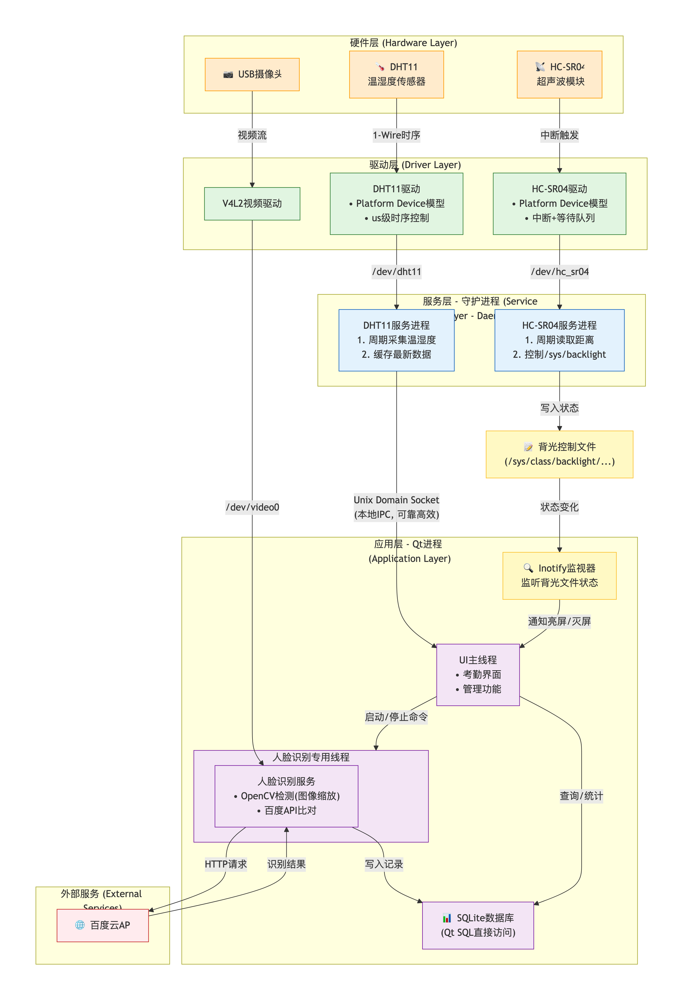

# 基于I.MX6ULL的考勤系统

## 概述

这是一个基于嵌入式 Linux 的人脸识别考勤终端。集成摄像头、人脸识别、外部传感器、轻量级的电源管理模块与本地数据库，
支持本地离线考勤与管理, 界面采用Qt去构建。

## 项目总体结构

## 核心功能

- 基于 USB 摄像头的人脸采集与识别考勤
- 本地 SQLite 数据库存储考勤记录与人员信息
- 管理员登录与基础系统管理界面
- 外部传感器接入（HC-SR04 / DHT11）
- 简单的功耗控制与资源管理
- 通过轻量级的ssh,可远程对终端进行管理

## 运行环境

- 硬件平台：i.MX6ULL

- 操作系统：Embedded Linux 4.19

- UI 框架：Qt 5.12.9

- 人脸检测：OpenCV 4.5.2（本地）

- 人脸识别: 百度API （远程）

- 数据库：SQLite

  

## 设计说明

- 项目采用多线程模型，人脸检测线程与 UI 线程解耦运行，保证界面不阻塞。  
  人脸检测阶段使用 OpenCV 进行本地检测，仅在检测到人脸时才调用百度 API 进行识别，从而减少无效的网络请求与计算开销。
- 项目采用多进程协同方式，使用原生 Linux 系统编程 API 编写独立的服务程序与 UI 进行交互。  
  UI 不直接操作硬件，而是通过中间层服务程序间接获取数据，实现 UI 与硬件的解耦。  
  实际测试表明，该方式显著降低了 DHT11 传感器异常读数的出现概率。

- 底层驱动采用 platform 字符设备模型，并结合设备树完成硬件资源描述与管理。

  1. **DHT11**：通过微秒级时序控制实现对传感器的稳定驱动。  
  2. **HC-SR04**：采用中断、等待队列与工作队列协同工作。在未检测到物体时进程处于阻塞状态；当检测到物体时触发中断，唤醒阻塞进程，从而显著降低 CPU 占用率。

- 中间层作为 UI 与底层驱动之间的桥梁，负责数据采集与状态协调。

  1. **DHT11**：服务程序周期性采集温湿度数据，进程间通信采用本地套接字（UNIX Socket），使用 C/S 模型，服务程序作为服务器，UI 作为客户端接收数据。  
  2. **HC-SR04**：周期性检测前方有效距离内是否存在物体，并根据检测结果修改背光控制文件，实现“有人亮屏、无人灭屏”的效果。

- 轻量级电源管理的实现关键在于 UI 通过 Linux 的 inotify 机制监听 HC-SR04 服务程序对背光文件的修改。  
  UI 根据背光状态动态控制摄像头与人脸检测线程的启停，在灭屏状态下系统 CPU 占用率接近 0，从而显著降低整体功耗。

## 项目亮点

- UI 与硬件完全解耦，系统稳定性高
- 人脸识别按需触发，资源占用可控
- 基于 inotify 的轻量级功耗管理